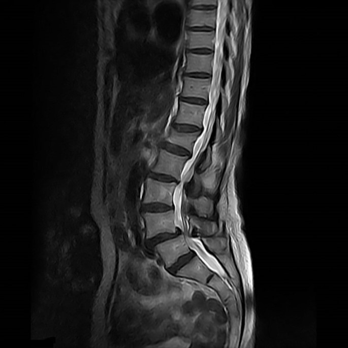
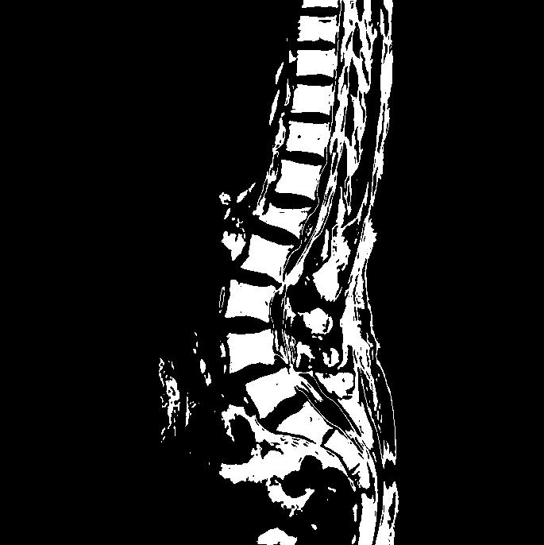

# Assignment 1

This folder contains matlab script (`2016A7PS0150P_For_assign1.m`) to enhance an image (`For_asign1.jpg`) using thresholding. The output image is `2016A7PS0150P_Enhanced_For_assignment1.jpg`.

Original Image:

Enhanced Image:

