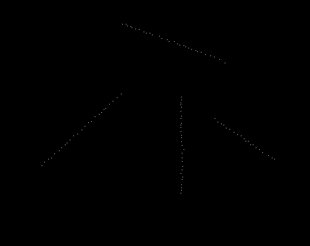
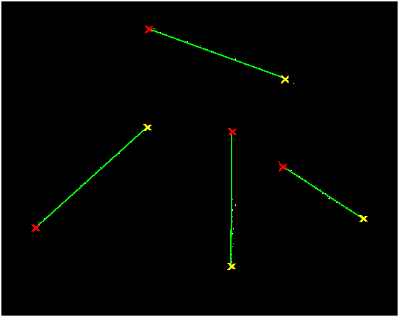
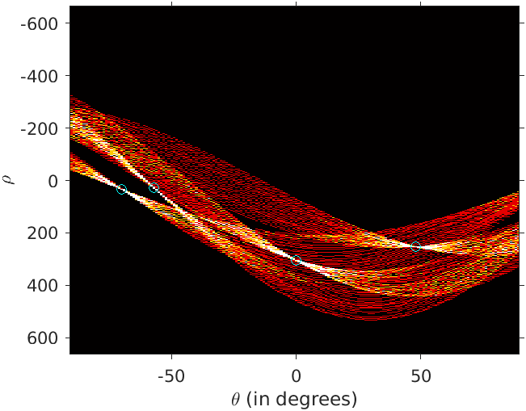

# Assignment 2

This folder contains matlab script (`assignment2_submission_v2.m`) to apply hough transformation and classify the pixels corresponding to each of the straight line in the given image (`img_assgn2.png`). It is a binary image with `max graylevel=1` and `min graylevel=0`.

Original Image:

Result Image:

Plot of Hough Transform:

