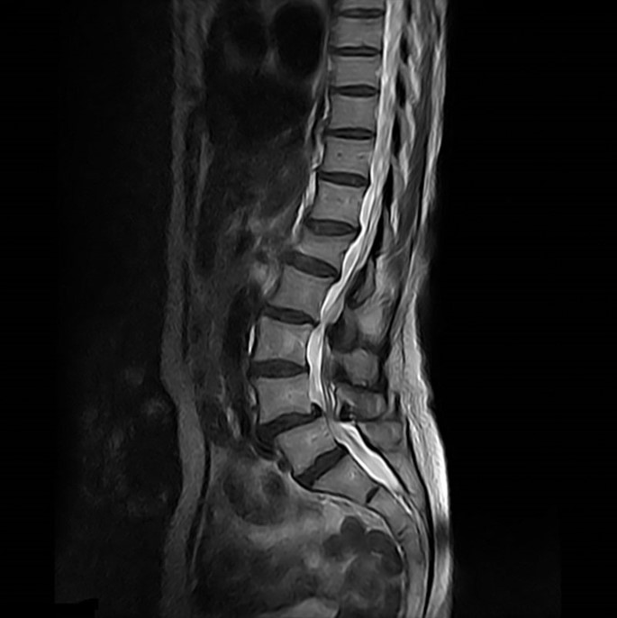

# Automatic Global Thresholding

The script `automatic_global_thresholding.m` contains the code to perform thresholding with automatically discovered lower and upper bounds, as shown below:

Original Image:

Result Image:

