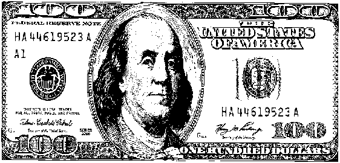
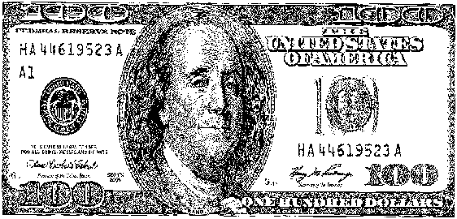
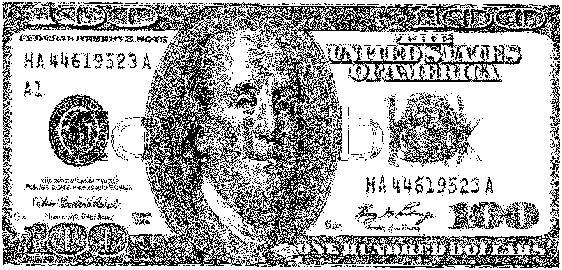
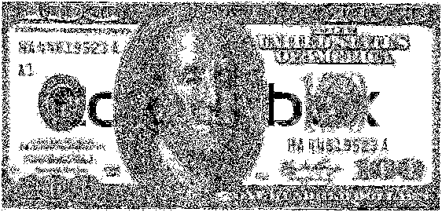
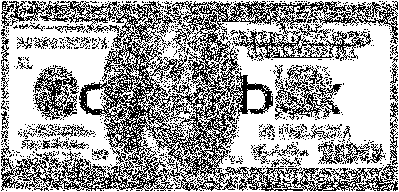
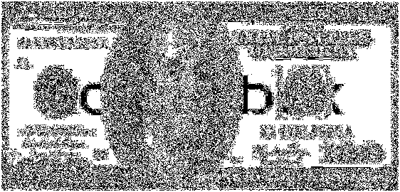
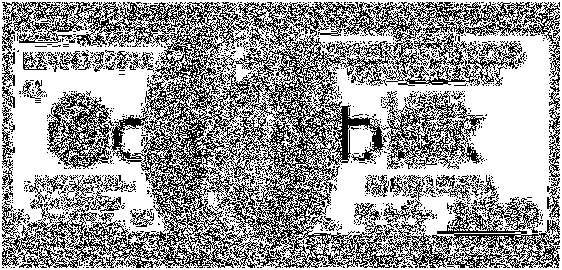

# Bit-Plane Slicing of an Image

The script `bit_plane_slicing.m` contains the code to slice the `8` different bit planes of an input black-and-white image.

Original Image:

7th Bit-Plane Image:

6th Bit-Plane Image:

5th Bit-Plane Image:

4th Bit-Plane Image:

3rd Bit-Plane Image:

2nd Bit-Plane Image:

1st Bit-Plane Image:

0th Bit-Plane Image:

