# Find all Connected Components in an Image

The script `connected_components.m` contains the code to separate all connected components in an image, as shown below:

Original Image:

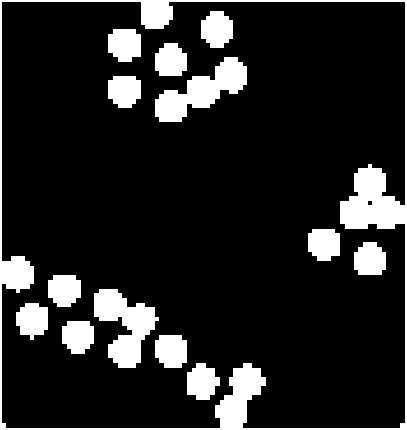

Resuling Connected Components:

 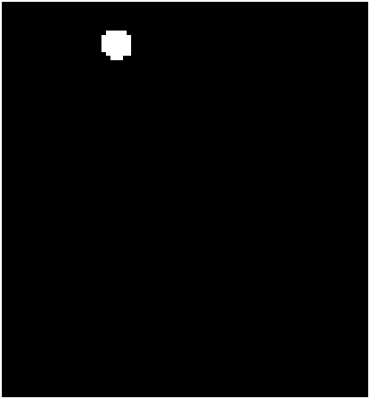
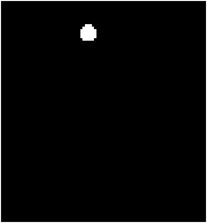 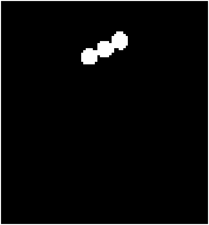
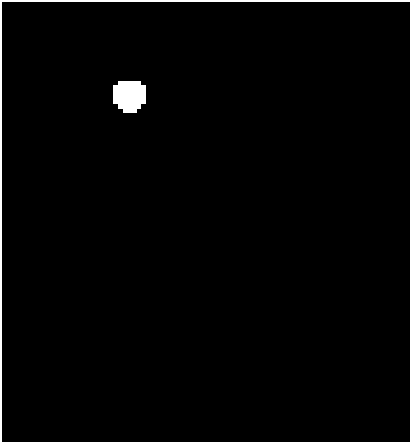 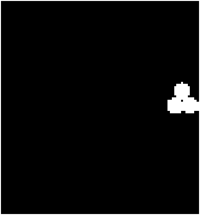
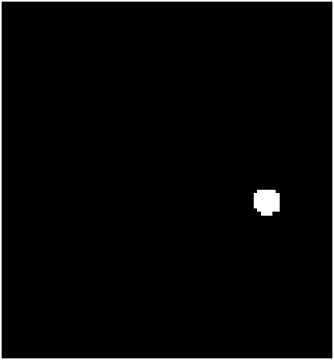 
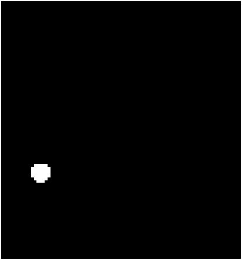 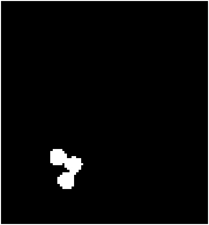
 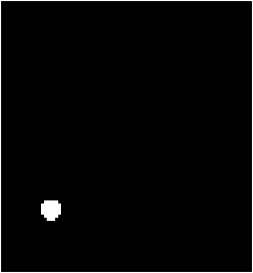
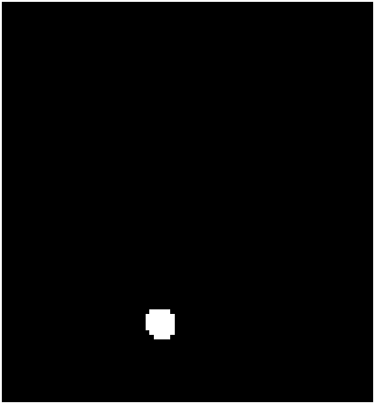 
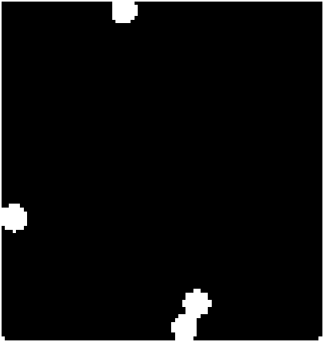

