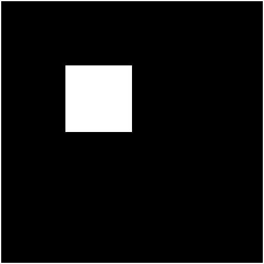
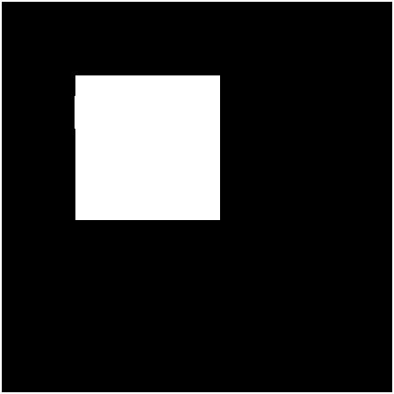

# Perform Dilation on an Image using a Square Strel

The script `dilation.m` contains the code to perform dilation on an image using a square strel, as shown below:

Original Image:

Result Image:

