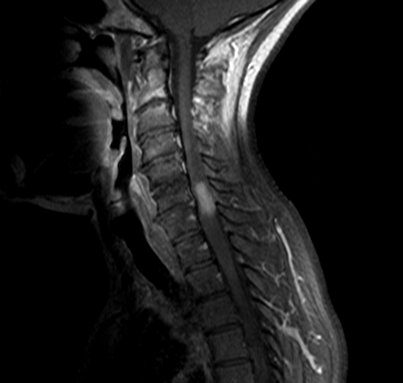
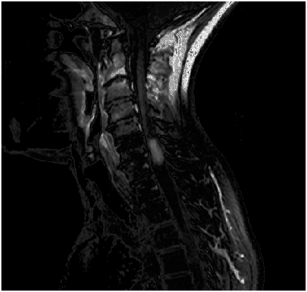
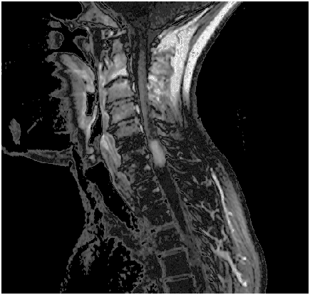

# Taking Gamma Transform of an Image

The script `gamma_transform.m` contains the code to perform gamma transformation on an image, as shown below:

Original Image:

`C=1, Gamma=1.5` Image (Compress Dark Levels):

`C=1, Gamma=0.75` Image (Stretch Dark Levels):

