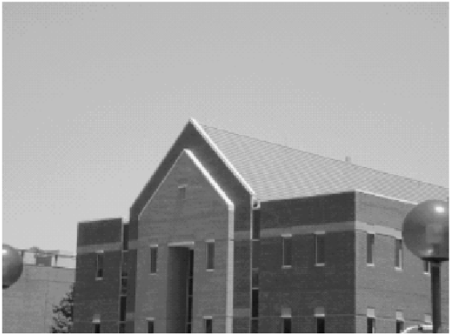
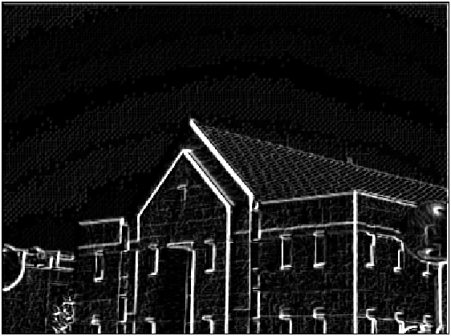

# Compute Gradient of an Image

The script `gradient.m` contains the code to compute gradient on an image (using four masks: horizontal Prewitt mask, vertical Prewitt mask, `45°` diagonal Prewitt mask and `135°` diagonal Prewitt mask), as shown below:

Original Image:

Gradient Image:

