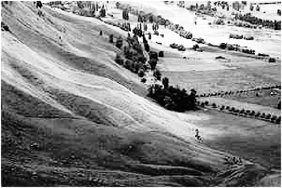

# Histogram Equalization for better contrast Image

The script `histogram_equalization.m` contains the code for histogram equalization to obtain a better contrast image, as shown below:

Original Image:

Result Image:

