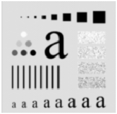

# Weighted averaging mask run on an Image to produce slight Blurring Effect

The script `weighted_averaging.m` contains the code to run a weighted averaging mask on an image to produce a slight blurring effect, as shown below:

Original Image:

Result Image:

